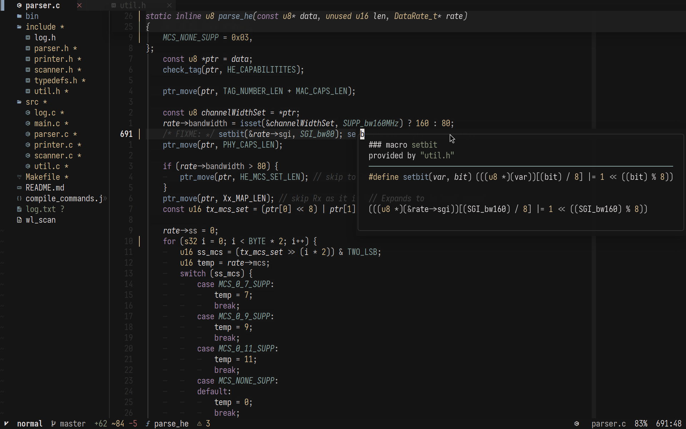
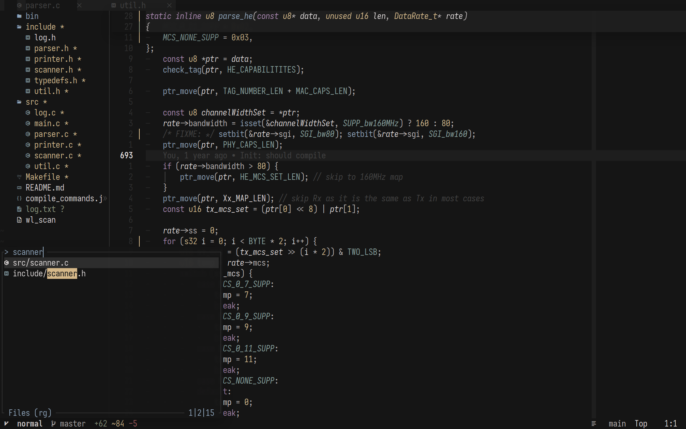
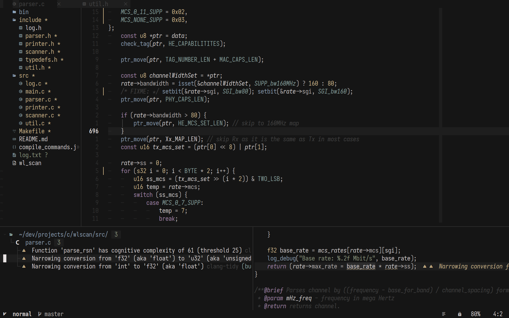
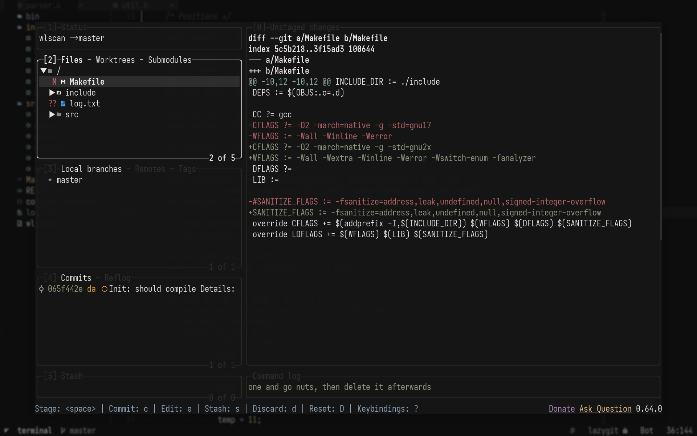

<div align="center">
 <a href="https://git.io/typing-svg"></a>
</div>

<h1 align="center"> nixvim-based neovim configuration <br> focused on C and Rust development </h1>




<details>
    <summary><h3>More screenshots</h3></summary>
    <br>
    
    
    
    
    
    
    
</details>

## Configuring

Edit the Nix files in `./config`.
Add new configuration files to [`config/default.nix`](../config/default.nix).

### Plugins
LSP
-  blink.cmp: Completion.
-  nvim-lspconfig: Language server configuration.
-  clangd-extensions.nvim: Clangd extensions and inlay hints.
-  rustaceanvim: Rust Analyzer, Clippy, Cargo, and DAP.
-  nvim-navic: LSP symbols in the statusline.

UI
-  lualine.nvim: Statusline.
-  bufferline.nvim: Buffer list.
-  noice.nvim: Command line and message UI.
-  markview.nvim: Markdown and Avante rendering.
-  nvim-web-devicons: File type icons.
-  snacks.nvim: Dashboard, terminal, Zen mode, LazyGit, and scratch buffers.
-  mini.nvim: Keymap hints, picker, surround, and color highlighting.

Treesitter
-  nvim-treesitter: Syntax, parsing, folding, and indentation.
-  treesitter-context: Context at the top of the window.
-  treesitter-textobjects: Structural selection and parameter swapping.

Git
-  gitsigns.nvim: Git signs and hunk actions.
-  codediff.nvim: Diff and merge views.

Utilities
-  fyler.nvim: File explorer.
-  flash.nvim: Jump and search motions.
-  trouble.nvim: Diagnostics, references, TODOs, and quickfix lists.
-  smart-splits.nvim: Split navigation and resizing.
-  undotree: Undo history.
-  todo-comments.nvim: TODO and FIXME highlighting.
-  persistence.nvim: Branch-specific and named sessions.
-  lz-n: Lazy loading.
-  Compile integration: `make -B` and quickfix diagnostics.

Debugging
-  nvim-dap: Debug Adapter Protocol.
-  nvim-dap-ui: Debugger UI.
-  nvim-dap-virtual-text: Debug values as virtual text.
-  Adapters: GDB, LLDB, and CodeLLDB for C, C++, and Rust.

AI
-  avante.nvim: Gemini chat, inline edits, and suggestions.
-  blink-cmp-avante: Avante completion.

Finders
-  mini.pick: File, buffer, help, LSP, Git, project, and grep pickers.


## Keymaps
The leader key is `<Space>`. `mini.clue` shows available key groups.

Code and LSP
-  `gx`: Open the path under the cursor.
-  `<leader>cs`: Switch source/header.
-  `<leader>ct`: Search tags.
-  `<leader>cl`: Copy Git-relative path and line.
-  `<leader>cv`: Show numeric and Base64 conversions.
-  `<leader>ch`: Toggle hex view.
-  `<leader>ci`: Toggle inlay hints.
-  `<leader>cf`: Format.
-  `<leader>cd`: Show line diagnostics.
-  `cp` / `cP`: Preview definition/type definition.
-  `<leader>cc` / `<leader>ce`: Run Rust code/explain error.

Finders and Git
-  `<leader>ff` / `<leader><Space>`: Files.
-  `<leader>fb` / `<leader>fo`: Buffers/old files.
-  `<leader>fh` / `<leader>fk`: Help/keymaps.
-  `<leader>fp`: Projects.
-  `<leader>fw`: Live grep.
-  `<leader>f?` / `<leader>f/`: All/current buffer lines.
-  `<leader>fT`: Color schemes.
-  `<leader>gB` / `<leader>gs` / `<leader>gS`: Branches/status/stashes.

UI and Navigation
-  `<leader>uT`: Toggle Paradise variant.
-  `<leader>ul` / `<leader>uL`: Toggle absolute/relative line numbers.
-  `<leader>uw` / `<leader>um` / `<leader>uv`: Toggle wrap/Markview/diagnostic virtual text.
-  `<leader>cz`: Toggle Zen mode.
-  `<leader>e`: Toggle Fyler.
-  `<leader>bd` / `<leader>bb`: Delete/switch buffer.
-  `<leader>br` / `<leader>bl` / `<leader>bo`: Close right/left/other buffers.
-  `<leader>bp` / `<leader>bP`: Pin/close non-pinned buffers.
-  `<C-h>` / `<C-j>` / `<C-k>` / `<C-l>`: Move between splits.
-  `<A-h>` / `<A-j>` / `<A-k>` / `<A-l>`: Resize splits.
-  `<leader>ww` / `<leader>wd`: Other/close window.
-  `<leader>w-` / `<leader>w|`: Split below/right.
-  `<leader><Tab><Tab>` / `<leader><Tab>d`: New/close tab.

Editing
-  `J` / `K` in visual mode: Move selection down/up.
-  `J` in normal mode: Join lines.
-  `n` / `N`: Next/previous search result.
-  `<C-d>` / `<C-u>`: Scroll down/up and center.
-  `<leader>R`: Replace word under cursor.
-  `<leader>fy`: Copy search matches.
-  `<leader>y` / `<leader>Y`: Yank selection/line to clipboard.
-  `<leader>p` / `<leader>D`: Paste/delete without changing the register.
-  `<C-s>`: Save.

Sessions, Build, and Diagnostics
-  `<leader>qs` / `<leader>qS`: Restore/select session.
-  `<leader>qn` / `<leader>qN`: Save/load named session.
-  `<leader>ql` / `<leader>qd`: Restore last/disable session saving.
-  `<leader>qq`: Quit all.
-  `<leader>mc` / `<leader>mn` / `<leader>mp`: Compile/next/previous error.
-  `<leader>mq` / `<leader>mo`: Close/open compile terminal.
-  `<leader>xX` / `<leader>xx` / `<leader>xl`: All/buffer/LSP diagnostics.
-  `<leader>xt` / `<leader>xQ`: TODO/quickfix list.

Debugging and AI
-  `<leader>db` / `<leader>dc` / `<leader>dt`: Breakpoint/start/terminate.
-  `<leader>di` / `<leader>do` / `<leader>dO`: Step into/out/over.
-  `<leader>dr` / `<leader>du` / `<leader>de`: REPL/UI/evaluate.
-  `<leader>aa` / `<leader>ae` / `<leader>as`: Avante chat/edit/suggestions.

Run with Nix:

```shell
nix run 'github:danylo-volchenko/nixvi'
```

The default output includes `nvim`, `gnvim`, and `neovide`. In Neovide,
`<C-=>`, `<C-->`, and `<C-0>` increase, decrease, or reset the scale factor.
[`config.toml`](../config.toml) contains the Iosevka Nerd Font Mono profile.

## Installing into NixOS configuration

This `nixvim` flake exposes a package that you can include in either
`home.packages` for Home Manager or `environment.systemPackages` for NixOS.
The package includes the terminal and GUI launchers described above.

Add the flake as an input:

```nix
{
 inputs = {
    nixvim.url = "github:danylo-volchenko/nixvi";
 };
}
```

### Direct installation

With the input added you can reference it directly.

```nix
{ inputs, system, ... }:
{
  # NixOS
  environment.systemPackages = [ inputs.nixvim.packages.${pkgs.system}.default ];
  # Home Manager
  home.packages = [ inputs.nixvim.packages.${pkgs.system}.default ];
}
```

The terminal binary is named `nvim`, and the GUI wrapper is available as both
`gnvim` and `neovide`.

### Installing as an overlay

Alternatively, overlay the build over `neovim` from `nixpkgs`.

Install `neovim` normally, but replace `neovim` in `pkgs` with the flake
derivation (`home.packages = with pkgs; [ neovim ]`).

```nix
{
  pkgs = import inputs.nixpkgs {
    overlays = [
      (final: prev: {
        neovim = inputs.nixvim.packages.${pkgs.system}.default;
      })
    ];
  }
}
```
